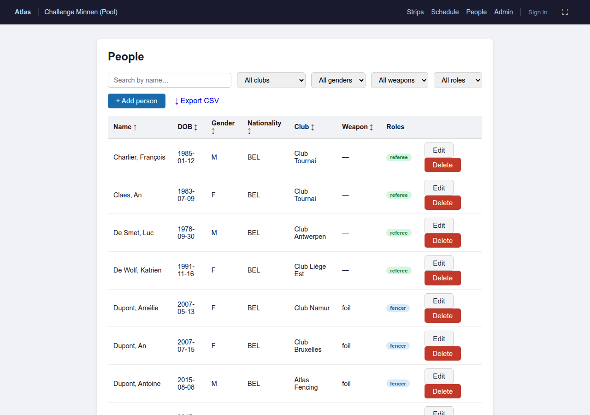

# Competition Manager Guide

Atlas is a fencing competition management system designed to run pool rounds and direct elimination tableaux on competition day. This guide walks you through the full workflow from first setup to final results.

---

## 1. Key Terms

A few words Atlas uses that may not match the terminology you are used to.

**Tournament**
A named series of events, for example *Belgian Championship 2026*. A tournament is mainly an organisational container — it groups competitions together and appears in menus and exports.

**Competition**
One event within a tournament: a specific weapon, gender, and age category, for example *Men's Foil U17*. This is where fencers register, rounds are created, and results are recorded.

**Fencer**
A person in Atlas's database — their name, club, licence number, and national ranking. A fencer exists independently of any competition.

**Competitor**
A fencer entered in a specific competition. Adding someone as a competitor links their fencer record to that competition and assigns them an initial seed. The distinction matters because the same fencer can compete in multiple events, each with their own seed and ranking.

**Round**
One stage of a competition — either a pool round or a direct elimination tableau. A competition typically has one or two pool rounds followed by one DE round. Each round produces a ranking that seeds the next round.

**Strip / Piste**
The physical fencing strip. Atlas calls these *strips* throughout the interface; fencers and referees will know them as pistes. Each strip can be connected to a scoring apparatus via OPP2 (see Appendix C).

**Seed**
A fencer's starting rank within a round, derived from their national ranking or from the results of the previous round. Lower numbers are better — seed 1 is the highest-ranked fencer.

---

## 2. Before Competition Day

This section covers everything to prepare in the days before the event: clubs, fencer records, and verifying the start list. Do this in advance — competition morning is not the right time to add 40 fencers.

### 2.1 Clubs and NOCs

Before adding fencers you need the clubs and nationalities in place, because fencer records reference them.

**Clubs** have their own page — click **Clubs** in the navigation bar. Each club has a name, an optional short name (used on scoresheets), and an optional country code.


Click **Add club** at the bottom to create a new entry. Atlas blocks duplicate names case-insensitively — *Club Namur* and *CLUB NAMUR* are treated as the same club.

If you discover two clubs that should be one (a common result of CSV imports from different sources), use **Merge →**. Select the club to keep as the target; all fencers are moved to the target club and the source club is deleted. This is the correct way to fix spelling variants — do not simply delete a club that has fencers.

The **Delete** button is disabled on any club that still has fencers assigned to it.

**NOCs** (National Olympic Committees) are the nationality codes used for international events. A standard list of IOC country codes is pre-loaded; you only need to add custom entries if your federation uses non-standard codes.

---

### 2.2 Adding fencers manually

Go to **People** in the navigation bar. Click **+ Add person**.

Fill in the personal details:

| Field | Required | Notes |
|---|---|---|
| First name | Yes | |
| Last name | Yes | |
| Date of birth | No | Used for age-category eligibility checks |
| Gender | No | Used to filter eligible competitors |
| Nationality | No | Choose from the NOC list |
| Club | No | Choose from the clubs list |

Tick the **Fencer** checkbox to reveal the fencer profile fields:

| Field | Notes |
|---|---|
| Licence | Your federation's licence number — used as the unique key during CSV import |
| Handedness | Left or Right |
| Weapons | Comma-separated: `foil`, `epee`, `sabre` |
| Ranking | National ranking number (lower = better) — used for auto-seeding |
| Points | Ranking points (for display; not used in seeding calculations) |

Click **Save**. The person appears in the list immediately.

A person can hold both the **Fencer** and **Referee** roles at the same time — tick both checkboxes and fill in each profile section.



---

### 2.3 Importing fencers from CSV

For larger start lists, CSV import is faster than manual entry. On the **People** page, expand the **Import fencers from CSV** section at the bottom.

**Required columns:**

```
first_name, last_name
```

**Optional columns:**

```
date_of_birth, gender, nationality, club, licence, weapons, handedness, ranking, points
```

Column order does not matter as long as the header row is present. The `club` column takes the club name as a string — Atlas matches it to an existing club by name, or creates the club if it does not exist yet.

**Update behaviour:** if a row has a `licence` value that matches an existing fencer, that record is updated in place. If there is no licence, Atlas matches on `first_name + last_name + date_of_birth`. Rows that do not match any existing record are created as new fencers.

Paste your CSV text into the text area and click **Import**. A summary line appears showing how many records were created and updated.

> **Tip:** Export your existing fencer list first (**↓ Export CSV** button in the toolbar) to see the exact column format Atlas uses. This is also useful for keeping a backup or sharing the list with another system.

---

### 2.4 Reviewing and editing fencer records

Use the toolbar filters to find fencers quickly:

- **Search box** — matches on first or last name
- **Club** dropdown — filter to one club
- **Gender** dropdown
- **Weapon** dropdown
- **Role** dropdown — show only fencers or only referees

Click any column header to sort by that column. Click again to reverse the sort.

To correct a record, click **Edit** on that row. The same form used for adding opens with the existing values pre-filled. Click **Save** when done.

> **Before the competition:** check that every fencer who should compete has the correct weapon, gender, and date of birth set. These are the fields Atlas uses to decide who is eligible when you add competitors to a competition. A fencer with the wrong weapon will not appear in the eligible list.

---

## 3. Setting Up a Competition

Everything starts on the **Tournaments & Competitions** page — click **Competitions** or **Tournaments** in the main nav (they share the same page, with two tabs).

---

### 3.1 Creating a tournament

A tournament is optional but recommended if you are running several competitions on the same day — it keeps them grouped in the list and in exports.

Click the **Tournaments** tab, then **+ New tournament**. Fill in the fields you need:

| Field | Notes |
|---|---|
| Name | e.g. *Belgian Championship 2026* |
| City / Country | For display and exports |
| Start / End date | The dates the event runs |
| Organizer | Club or federation running the event |
| Level | e.g. *Regional*, *National*, *International* |

Click **Save**. The tournament appears in the list and is available as a grouping option when you create competitions.

---

### 3.2 Creating a competition

Click the **Competitions** tab, then **+ New competition**.

| Field | Required | Notes |
|---|---|---|
| Name | Yes | e.g. *U17 Foil Men* — shown throughout the app |
| Weapon | Yes | Foil, Épée, or Sabre |
| Gender | Yes | Male, Female, or Mixed/Open — used to filter eligible fencers |
| Date | No | The competition date |
| Tournament | No | Link this competition to a tournament for grouping |
| Age categories | No | Tick one or more; used together with date of birth to filter eligible fencers |

Click **Save**. The competition appears in the list with status *draft*.

> **Age categories** are defined by your federation (e.g. U17 means born no more than 17 years before the competition year). If no age category is selected, all fencers of the right weapon and gender are eligible regardless of age.

---

### 3.3 Adding competitors

Click the competition name to open the competition detail page.

The right panel shows **Eligible fencers** — everyone in Atlas whose weapon, gender, and age match this competition. Use the search box or the club filter to find fencers quickly.

Click **+ Add** next to a fencer's name to register them as a competitor. Their national ranking becomes their initial seed. You can add fencers one at a time or work through the list systematically.

To remove a competitor, click **Remove** next to their name in the competitors list on the left panel.


> **Tip:** click **⚡ Auto-seed by ranking** after you have added all competitors. Atlas re-assigns seeds in national ranking order (lowest number = best). Do this last — adding more competitors after auto-seeding will place new arrivals at the end of the list.

---

### 3.4 Seeding from national ranking

Click **⚡ Auto-seed by ranking** on the competition detail page. Atlas sorts all registered competitors by their national ranking field (set on each fencer record) and assigns seed 1 to the highest-ranked fencer, seed 2 to the next, and so on.

Fencers with no ranking are placed at the end, in the order they were added.

---

### 3.5 Manual seed adjustments

The seed numbers in the competitors list are editable. Click on a seed number, type the new value, and press Enter. Seeds do not need to be unique at this stage — if you assign the same number to two fencers, Atlas will warn you when you try to create a pool round.

> Once a pool round has been created, changing seeds has no effect on that round's pool assignments. Adjust seeds before creating the first round.

---

### 3.6 Check-in on competition day

Before drawing pools, use the **Check-in** page to record which registered fencers have actually arrived and to mark any withdrawals. This ensures the pool draw reflects the real start list.

**How to get there:** on the competition detail page, click the **Check-in** button near the top. The URL is `/checkin.html?id=<competition-id>`.

The page shows every competitor grouped by club, with a summary bar at the top:

| Indicator | Meaning |
|---|---|
| **Total** | All competitors added to this competition |
| **Present** | Confirmed arrived (green) |
| **Not yet** | No status recorded yet (grey) |
| **Withdrawn** | Marked absent / withdrawn (red, faded) |

**Marking fencers:**

- **Present** — click the green button next to the fencer's name. Click again to revert to "not yet".
- **Absent / Withdrawn** — click the red button. The fencer is flagged as withdrawn and will appear faded. Click again to revert.
- **✓ All present** — marks every non-withdrawn fencer as present in one step. Useful at small events where the whole list arrives.
- **Clear all** — resets all statuses back to "not yet".

Use the search box to find a fencer quickly by name or club. The filter tabs (**All / Not yet / Present / Withdrawn**) let you focus on one group at a time — for example, show only "Not yet" to work through the remaining arrivals.

**What check-in does and does not do:**

- Marking a fencer **withdrawn** sets their status so that Atlas will **exclude them from the pool draw**. Do this before creating the first pool round.
- Marking a fencer **present** is informational only — it does not affect seeding or pool formation.
- Check-in does **not** remove a fencer from the competition. A withdrawn fencer stays visible in the list and can be reinstated if they arrive late. To permanently remove a fencer, use the **Remove** action on the competition detail page instead.
- Late arrivals after pools are drawn cannot be added to an existing round. The pool draw is final once created.

> **Tip:** use the **Not yet** filter as your working view during check-in. As fencers arrive and you mark them present, the list shortens until only withdrawals and no-shows remain.

---

## 4. Running a Pool Round

### 4.1 Creating a pool round

Open the competition detail page and click **+ New round**. Choose **Pool round** from the two options at the top of the form.

**Rule document** — select the rule set that governs this round. The rule document defines the pool sizes Atlas will consider and what percentage of fencers advance at the end. For most club competitions, only one option is available.

**Separation** — choose how Atlas tries to keep fencers apart when forming pools:

| Option | Use when |
|---|---|
| Club | Local or national competitions — fencers from the same club are separated |
| Nationality | International events — fencers from the same country are separated |
| Nationality + Club | FIE standard — separates by nationality first, then by club |

Click **Calculate pool options**. Atlas counts the active competitors and shows every valid way to form pools of that size (for example, 42 fencers can be split into 6 pools of 7 or 7 pools of 6). The recommended option is marked.

Select the formation you want and click **Create pools**. Atlas assigns fencers to pools using FIE serpentine seeding — seed 1 goes to pool 1, seed 2 to pool 2, and so on, reversing direction each pass — and respects the separation rule as closely as possible.

The competition detail page now shows the new round. Click **Open** to go to the round page.

On the round page, click **▶ Activate round** to open the round for scoring. This locks the pool assignments and makes the score entry links available.


---

### 4.2 Pool formation options

Atlas shows all valid *uniform* formations (all pools the same size) and any valid *mixed* formations (one size differs by one fencer). If the numbers work out cleanly in only one way, only one option is shown.

> **Tip:** If you need to manually move a fencer from one pool to another after creation — for example because a late withdrawal changes the separation — contact the person managing the draw. Pool assignments cannot currently be edited in the UI once the round is created; delete the round and re-create it if a change is needed before scoring starts.

---

### 4.3 Assigning strips to pools

On the round page each pool is shown as a card. A card displays the pool number, the assigned strip, and the assigned referee — or *No strip assigned* / *No referee assigned* if not yet set.

Click **Assign strip/ref** on a pool card to open the assignment panel. Choose a strip and a referee from the dropdowns and click **Save**. The card updates immediately.

Strip assignment is optional for score entry — you can enter scores manually on any device without a strip assignment. Assignments become important when using OPP2: the scoring apparatus on that strip will receive the correct bout list automatically (see Appendix C).

---

### 4.4 Entering scores

Click **Open** on a pool card to open the pool scoresheet. Bouts are listed in FIE official bout order.


Each row shows:
- The bout number (FIE order)
- Left fencer's name
- Score input boxes
- Right fencer's name
- An undo button (↩)

**To enter a score:** type the left fencer's score in the left box and press Tab, then type the right fencer's score in the right box. The result is saved as soon as you leave the field. The winning fencer's name turns green.

**Equal scores (tie):** if both scores are the same, a small dropdown appears between the names asking you to pick the winner. This happens when a bout ends in overtime priority. Select the fencer who won priority and the bout is saved.

**Undo:** click the red **↩** button on any finished bout to clear its score and return it to pending. Only the most recent entry can be undone.

Bouts can be entered in any order — you do not need to follow the printed bout sheet sequence.

---

### 4.5 Live rankings

The round page shows a live rankings table below the pool cards. It updates automatically as scores come in; no page refresh is needed.

| Column | Meaning |
|---|---|
| V | Victories |
| V/M | Victory ratio (victories ÷ bouts fenced) |
| Ind | Indicator (touches scored minus touches received) |
| TS | Touches scored |
| TR | Touches received |

Fencers are ranked in order: best V/M first, then best indicator, then most touches scored. The label *(live — not saved yet)* is shown while the round is open to make clear that these standings are provisional.

---

### 4.6 Closing the round and advancing fencers

The **✓ Close round** button is enabled only when every bout in every pool has a result. While bouts remain, the button shows *Bouts remaining: N* as a reminder.

When you click **Close round**, Atlas:
1. Saves the final standings permanently
2. Applies the advancement rule from the rule document (for example, advance the top 70%)
3. Marks each competitor as *advanced* (shown in green) or *eliminated* (shown in red)

The round status changes to *finished*. Advancing competitors carry their seeding into the next round; their V/M, indicator, and touches scored are used to seed the subsequent pool round or DE tableau.

> **Reopening a round:** if you need to correct a score after closing, click **Reopen round** at the top of the round page. This clears the saved rankings and advancement decisions but keeps all the scores. Re-enter or correct any bout, then close again.

---

## 5. Running a Second Pool Round

A second pool round is common in larger competitions — it lets you see everyone fence twice before cutting to DE, and produces a more reliable seeding for the tableau.

### 5.1 Creating a follow-on pool round

Close the first pool round (§4.6). The competition detail page will show the first round with status *finished*.

Click **+ New round**, choose **Pool round**, select a rule document, and click **Calculate pool options**. Atlas automatically uses the final ranking of the previous round as the seeding input — seed 1 in the new round is the fencer who ranked first overall in the previous round.

Everything else works identically to the first pool round: choose pool sizes, set separation, assign strips, enter scores, close. Only advancing competitors from the first round appear in the second round — eliminated fencers do not re-enter.

---

### 5.2 Combined seeding across pool rounds

When you create the DE round after two pool rounds, Atlas offers a choice of seeding method:

**Use last pool round ranking only** — the DE seed is taken from the second pool round results alone. A fencer who had a bad first round but recovered is seeded purely on their second-round performance.

**Combined ranking across all pool rounds** — Atlas aggregates each fencer's V/M, indicator, and touches scored across both rounds and ranks them on the combined totals. This is the FIE standard approach and is fairer to fencers who performed consistently across both rounds.

The choice only appears when there are two or more finished pool rounds. For a single pool round there is nothing to choose — the seeding is always taken from that round's results.

---

## 6. Running Direct Elimination

### 6.1 Creating a DE round

Close all pool rounds first. On the competition detail page, click **+ New round** and choose **DE round**.

Select a rule document. Atlas automatically calculates and displays:

- **N competitors** — the number of fencers who advanced from the pool rounds
- **Tableau size** — the smallest power of 2 that fits N (e.g. 45 fencers → 64-person tableau)
- **Bye count** — the number of byes needed to fill the tableau (64 − 45 = 19 byes)

If two or more pool rounds were finished, the seeding method choice appears here (see §5.2).

Click **Create DE tableau**. Atlas builds the entire tableau immediately — all rounds from the round of 64 through to the final — and automatically scores all bye bouts. The phase opens with status *pending*.

Click **▶ Activate phase** on the DE page to begin scoring.

---

### 6.2 Reading the tableau

The tableau is displayed as columns from left (earliest round) to right (final). Each column is labelled: *Round of 64*, *Round of 32*, *Quarter-final*, *Semi-final*, *Final*.

Each box (bout card) shows two fencers and, once scored, their scores with the winner highlighted. Fencers are identified by name; their seed is shown in the results table at the bottom of the page once bouts are completed.

Click any bout card to open the score panel below the tableau.

---

### 6.3 Byes and their placement

Byes go to the **highest-seeded fencers**. If there are 19 byes in a 64-person tableau, seeds 1 through 19 each receive a bye in the first round and advance automatically to the second round.

Bye bouts are displayed in the tableau with the label *bye* and are already marked finished — you do not need to enter any score for them. The advancing fencer moves into the next round's slot automatically.

> **Why top seeds get byes:** this is FIE standard. Byes reward the best-ranked fencers from the pool rounds; lower-ranked fencers must fence an extra bout to advance.

---

### 6.4 Entering scores and advancing winners

Click a bout card to select it. The score panel appears below the tableau with the two fencers' names and number inputs.

Enter the left score and right score and click **Save score**. The winner advances automatically to the correct slot in the next round — you do not need to do anything else. The next round's bout card updates as soon as the score is saved.

**Ties (overtime):** if both scores are equal, two buttons appear — click the fencer who won priority. The result is saved with equal scores and the selected fencer as winner.

**Undo:** click **↩ Undo** on a finished bout to clear its score and the winner's advancement. This also clears any subsequent scores that depended on this bout (it removes the winner from the next round). Use this to correct a score entry mistake.

> Undo works through the tableau — if a fencer has already won their next bout, you must undo that result first before undoing the earlier one.

---

### 6.5 Simulating results (testing / demo)

Click **🎲 Simulate** to fill in all remaining bouts with random scores. This is useful for testing the tableau or demonstrating the app without real competition data.

Simulate can be run on a partially completed tableau — it only fills bouts that have no result yet.

---

### 6.6 Results table

As bouts are completed, a results table appears at the bottom of the DE page showing the current standings:

| Place | Fencer |
|---|---|
| 🥇 1st | Winner of the final |
| 🥈 2nd | Loser of the final |
| 3rd (shared) | Both semi-final losers — no bronze bout is held unless the rule document specifies one |
| 5th, 6th, 7th, 8th… | Quarter-final losers ranked by their pool-round seed |

The full competition results page (§7) combines these DE results with the pool-eliminated fencers for a complete ranking.

---

## 7. Results

### 7.1 Viewing the results page

The results page is available at any point during the competition — it updates live as bouts are scored. Access it from the **📋 Results** link on the competition detail page or from the DE page.

The table shows every competitor in the competition, ordered by final place, with columns for place, DE seed, name, club, and a note explaining how the rank was determined.


The page refreshes automatically when new scores come in — no manual reload needed.

---

### 7.2 How ranks are assigned

**Fencers who reached the DE tableau** are ranked by their DE result:

| Place | Assigned to |
|---|---|
| 1st | Winner of the final |
| 2nd | Loser of the final |
| 3rd (shared) | Both semi-final losers |
| 5th, 6th… | Quarter-final losers, ranked by DE seed |
| 9th–16th… | Round of 16 losers, ranked by DE seed |

3rd place is always shared between the two semi-final losers — no bronze bout is fenced unless the rule document explicitly requires one.

Within each eliminated group (everyone who lost in the same round), fencers are ranked by their DE seed — which is itself derived from their pool-round performance. Two fencers who lost in the same round cannot be separated by DE results alone.

**Fencers who were eliminated in the pool rounds** appear below the DE fencers and are ranked by their final pool standing (see §7.3).

---

### 7.3 Pool-eliminated fencers

Not every competitor advances to the DE — the advancement rule in the pool round closes off a percentage of the field. Eliminated fencers are appended to the results table below the DE rankings, in pool-ranking order.

The **Note** column shows which round eliminated them and their pool rank (e.g. *Pool round 1 (rank 28)*). This makes it clear how each fencer's place was determined.

> If you want to produce a printed results sheet, use your browser's print function (Ctrl+P / Cmd+P) from the results page. The sidebar is hidden in print view, giving a clean single-column layout.

---

## 8. Running Multiple Competitions Simultaneously

Atlas can run several competitions at the same time — for example Men's Foil U17 and Women's Épée Senior on the same set of strips. Each strip has an independent schedule called a **pipeline** that determines which bouts it fences and in what order.

> This section requires OPP2-connected apparatus. If you are entering scores manually on the pool scoresheet, strip assignment through the pipeline is not needed — use the simpler **Assign strip/ref** button on the phase page (§4.3) instead.

---

### 8.1 Strip pipeline overview

A pipeline is an ordered list of **slots** for one strip. A slot is either:

- A **pool** — all bouts from one pool, sent to the apparatus in FIE order
- A **DE range** — a selection of bouts from one round of a DE tableau (useful when multiple strips share a DE tableau, each fencing a different portion)

When the referee presses **NEXT** on the apparatus remote, Atlas finds the next pending bout in that strip's pipeline and sends the fencer names and match settings to the apparatus automatically. When all bouts in a slot are done, Atlas advances to the next slot without any manual intervention.

Each slot can carry optional timing information:

| Field | What it does |
|---|---|
| **Start** | The scheduled start time for this slot (HH:MM) |
| **Min/bout** | Estimated minutes per bout — used to calculate predicted end time |
| **Predicted end** | Displayed automatically as *start + (bout count × min/bout)* |
| **Referee** | The referee assigned to this slot — shown in the referee schedule view |

A ⚠ warning appears on a slot if its scheduled start time is earlier than the predicted end of the previous slot, flagging a scheduling overlap.

---

### 8.2 Building a strip pipeline

Open the **Schedule** page from the navigation bar. Each strip is shown as a card with its current pipeline.

**To add a slot:**

1. Click **+ Add slot** at the bottom of a strip's card
2. Choose the slot type: **Pool** or **DE range**

For a **Pool** slot:
- Select the competition and pool from the dropdown (only pools not already scheduled elsewhere are shown)
- Optionally set a start time, minutes per bout, and referee
- Click **Add**

For a **DE range** slot:
- Select the competition and DE phase
- Select the round (Round of 32, Quarter-final, etc.)
- Select the bout range — which bouts within that round this strip will fence
- Optionally set timing and referee
- Click **Add**

**To reorder slots:** use the **▲** and **▼** buttons. Slots are sent to the apparatus in the order they appear.

**To remove a slot:** click **Remove**. This does not affect any scores already recorded — it only removes the slot from the pipeline.

Completed slots collapse automatically into a compact *✓ done* row. Click the row to expand it again if you need to review it.


---

### 8.3 Referee schedule

The bottom of the Schedule page shows a **referee schedule** — all slots across all strips filtered by referee. Use the dropdown to select a referee and see their full assignment for the day: which pools and DE rounds they are assigned to, on which strips, and at what times.

This view is read-only; assignments are set per slot using the Referee dropdown in the slot detail (see §8.2).

---

## 9. User Accounts and Access

Atlas uses a role-based login system. Different roles are allowed to do different things. Everyone on the local network can read all public data without logging in — login is only required to make changes.

---

### 9.1 Roles and what they can do

There are four roles, in ascending order of authority:

| Role | Typical person | What they can do |
|---|---|---|
| **Referee** | Bout referee | Read all data. Enter and confirm bout scores. |
| **Assistant** | Entrance desk staff | Everything a Referee can do, plus: check in competitors, correct people and club records. |
| **Director** | Competition director | Everything an Assistant can do, plus: create and manage competitions, phases, pools, and bouts; manage strips; build strip pipelines. |
| **Admin** | System administrator | Everything a Director can do, plus: configure and connect the MQTT broker; create, delete, and manage user accounts. |

**Public (not logged in):** anyone on the local network can view all pools, results, tableaux, and schedules without a login. No login is required to follow the competition.

The hierarchy is strict: a Director can do everything an Assistant and Referee can do; an Admin can do everything a Director can do. There is no way to grant a narrower set of permissions within a role.

---

### 9.2 Logging in

All roles use **QR code + PIN** to log in:

1. Open `/login.html` or scan your accreditation badge QR code.
2. The QR code pre-fills your username in the login form — you only need to enter your PIN.
3. Enter your 6-digit PIN and press **Login**.
4. Your session lasts 12 hours. After that you will need to log in again.

If you do not have a QR badge, type your username directly in the login field and enter your PIN.

**Forgot your PIN?** Ask an Admin to reset it. The new PIN is shown once — write it down and change it when you next log in.

---

### 9.3 Managing user accounts (Admin only)

Go to the **Admin** page to manage accounts. From here you can:

- **Create a user** — choose a username and role. A 6-digit PIN is generated and shown once. The user must change it on first login.
- **Reset a PIN** — generates a new PIN shown once. Use this when a user has forgotten their PIN.
- **Delete a user** — permanently removes the account. The user is logged out immediately.

Each user account has a **QR code** that encodes a login link. Click the **QR** button on any account row to display it. Use **Print badge** to open a print-ready badge page for that user, or **Print all badges** to print accreditation badges for everyone at once. Print these before competition day and attach them to accreditation lanyards.

Scanning the badge QR with a phone or tablet opens `/login.html` with the username pre-filled — the user just enters their PIN.

---

### 9.4 QR codes: two types

Atlas generates two distinct kinds of QR code, used for different purposes:

**Accreditation QR codes (Admin page)**
- One per user account.
- Encodes a link to the login page pre-filled with that user's token.
- Printed on accreditation badges and given to referees, directors, and assistants.
- Scanning it lets the person log in quickly without typing their username.
- Requires a PIN — scanning the QR alone does not grant access.

**Piste scoresheet QR codes (Strips page → QR codes)**
- One per fencing strip.
- Encodes a link to the live scoresheet for that strip.
- Intended to be printed and posted at the entrance to each piste.
- Anyone can scan it — no login required. It opens a read-only view showing the current bout, scores, and pool record for that strip.
- Generate and print these before the session starts so referees and spectators can follow along on their phones.

---


### A.1 Column reference

| Column | Required | Notes |
|---|---|---|
| `first_name` | **Yes** | |
| `last_name` | **Yes** | |
| `date_of_birth` | No | See format note below |
| `gender` | No | `M`, `F`, or `X` |
| `nationality` | No | IOC 3-letter code (e.g. `BEL`, `FRA`, `NED`) |
| `club` | No | Matched by name; created if not found |
| `licence` | No | Federation licence number — used as the unique merge key |
| `weapons` | No | Comma-separated: `foil`, `epee`, `sabre` |
| `handedness` | No | `R` or `L` |
| `ranking` | No | Integer national ranking |
| `points` | No | Numeric ranking points |

Column order does not matter as long as the header row is present.

### A.2 Date of birth format

> **Important — international date format differences**
>
> Atlas stores and expects dates in **ISO 8601 format: `YYYY-MM-DD`** (e.g. `2005-03-17` for 17 March 2005).
>
> Many national federations and the FIE export dates in country-specific formats:
>
> | Convention | Example | Risk |
> |---|---|---|
> | Day/Month/Year (Belgium, France, UK, …) | `17/03/2005` | **Not accepted** — convert before importing |
> | Month/Day/Year (USA) | `03/17/2005` | **Not accepted** — and easily confused with DD/MM |
> | `YYYY-MM-DD` (ISO 8601) | `2005-03-17` | ✓ Accepted |
> | `DD-MM-YYYY` | `17-03-2005` | **Not accepted** |
>
> If dates import incorrectly (wrong age category, wrong eligibility), a format mismatch is almost always the cause.
> Inspect a few rows before importing a large file. Tools like Excel, LibreOffice, and most scripting languages can reformat dates in bulk.
>
> **Day/Month ambiguity:** a date like `03/05/2005` looks like 3 May in a European file but 5 March in a US file. There is no way for Atlas to detect this automatically — you must know the source convention.

### A.3 Merge behaviour

- If a row has a `licence` value that matches an existing fencer, that record is **updated in place**.
- If there is no `licence`, Atlas matches on `first_name + last_name + date_of_birth`. Both the name and the date must match exactly.
- Rows that do not match any existing record are **created** as new fencers.

> **Tip:** Export your existing fencer list first (**↓ Export CSV** button) to see the exact column format Atlas uses. Use this as a template when preparing an import from an external source.

### A.4 RFC-4180 compliance

The CSV parser follows RFC-4180. Fields containing commas or line breaks must be enclosed in double quotes. A literal double quote inside a quoted field is represented as two double quotes (`""`). The file must be UTF-8 encoded to correctly handle accented characters (é, ü, ñ, …).

## Appendix B — Keyboard and Navigation Tips

## Appendix C — Strips and OPP2

For full coverage of strip pipelines and OPP2 see Section 8.

### C.1 Defining strips

Strips are defined on the **Strips** page. Each strip has a name (e.g. *Green*) and a strip number. The strip number is the identifier used in OPP2 MQTT topics — it must match what the scoring apparatus is configured with.

From the Strips page, click **QR codes →** to open the piste QR code page. This page shows a printable QR code for each strip that links directly to the live scoresheet for that piste (see §9.4).

### C.2 Connecting to the MQTT broker

Open the **Admin** page and scroll to the OPP2 section. Enter the broker URL (default: `mqtt://openpiste.local:1883`) and click **Connect**. Atlas will attempt to reconnect to this broker automatically on every restart.

Only Admin users can connect, disconnect, or change the broker address.

### C.3 Building a strip pipeline

See Section 8 for the full pipeline workflow.

### C.4 Assigning referees to strips

Referees are assigned per pipeline slot on the Schedule page. The referee schedule view (bottom of the Schedule page) shows the full day's assignments for any selected referee across all strips.
